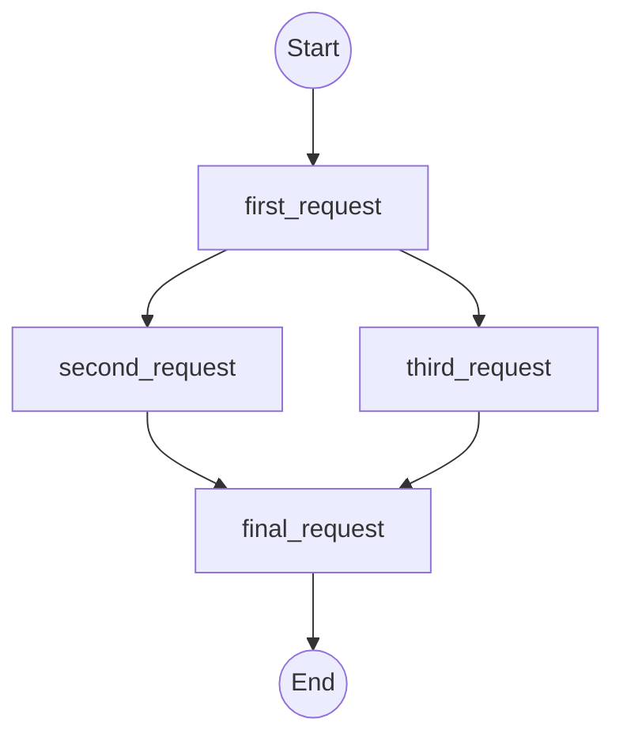

# burstgridgo

<div style="text-align: center;">
  <a href="https://github.com/specialistvlad/burstgridgo/actions/workflows/ci.yml">
    
  </a>
  <a href="https://codecov.io/github/specialistvlad/burstgridgo" > 
     
  </a>
  <a href="https://github.com/specialistvlad/burstgridgo/graphs/commit-activity">
    
  </a>
  <a href="https://github.com/specialistvlad/burstgridgo/issues">
    
  </a>
  <a href="https://github.com/specialistvlad/burstgridgo/pulls">
    
  </a>
  <a href="https://github.com/specialistvlad/burstgridgo/blob/main/LICENSE">
    
  </a>
</div>

 <br>

**⚠️ Important Note: Project Status ⚠️**

The project is currently under active development. The API and internal architecture are **not yet stable** and are subject to breaking changes. This project is not recommended for external production use; it is intended for testing and development of `burstgridgo` itself.


`burstgridgo` is a Go-native, declarative load testing tool for simulating real-world, protocol-aware workflows using HCL.

## Core Features
* **✅ Declarative Grids (HCL)**: Define complex, multi-protocol workflows in simple, composable HCL files. Make your test plans readable, versionable, and easy to manage.
* **✅ Intelligent Concurrency (DAG)**: The engine automatically builds a dependency graph (DAG) from your grid, running independent tasks in parallel for maximum efficiency. Dependencies are inferred automatically from variable usage.
* **✅ Extensible by Design**: Missing a protocol? `burstgridgo` is built on a simple Go `Runner` interface. Implement your own logic and immediately use it as a module in your HCL grid.

To see what's coming next, check out our full "Project Roadmap" below.


## Getting Started
Prerequisites: **Docker** and **Make**.

To run a grid for development with live-reloading, use the following command:
```sh
# This example runs the http_request.hcl grid
make dev grid=examples/http_request.hcl
```

## Example Workflow
The following grid defines a workflow with multiple dependent HTTP requests.
```hcl
# File: examples/http_request.hcl

step "http_request" "first" {
  arguments {
    url = "https://httpbin.org/get"
  }
}

step "http_request" "second" {
  arguments {
    url = "https://httpbin.org/delay/1"
  }
  depends_on = ["first"]
}

step "http_request" "third" {
  arguments {
    url = "https://httpbin.org/delay/2"
  }
  depends_on = ["first"]
}

step "http_request" "final" {
  arguments {
    url    = "https://httpbin.org/post"
    method = "POST"
  }
  depends_on = [
    "second",
    "third",
  ]
}
```

This configuration generates the following execution graph:


### 🧭 Project Roadmap

Our vision is to create the best tool for defining complex load tests as code. This roadmap is a living document that outlines our major development pillars, with status based on the current codebase.

*(✅ Implemented | 🏗️ In Progress | 💡 Planned)*

---

#### Pillar: Core Engine & HCL
This pillar covers the foundational execution engine, HCL parsing capabilities, and the overall architecture.

* **✅ Foundational DAG Executor**: The core engine, which builds a dependency graph from HCL, resolves dependencies (both implicit and explicit), and executes nodes concurrently, is fully implemented and includes cycle detection.
* **✅ Extensible Runner/Asset Architecture**: The system for defining stateless `runners` and stateful `assets` via HCL manifests and registering their Go implementations is complete. (See `ADR-001`)
* **✅ Stateful Resource Management**: The full lifecycle for `resource` blocks—including creation, destruction, and sharing instances between steps via the `uses` block—is implemented.
* **✅ Fail-Fast Execution**: The executor correctly cancels all running tasks as soon as one node fails, ensuring rapid feedback on errors.
* **💡 Dynamic Workflows & Meta-Arguments**: Full support for HCL features like `count`, `for_each`, and conditional logic is a top priority and is currently in the planning and design phase. (See `ADR-004`)

---

#### Pillar: Module Ecosystem
This pillar covers the expansion of our library of built-in runners and assets to support a wide range of protocols, datastores, and services.

**Module Enhancements**
* **💡 `http_request` Runner**:
    * Add support for custom `headers`, request `body`, `query_params`, and `form_data`.
    * Introduce helpers for common authentication schemes (e.g., Bearer Token, Basic Auth).
* **💡 `s3` Runner**:
    * Expand beyond pre-signed URLs to support standard S3 API actions (`put_object`, `get_object`, `delete_object`, `list_objects`) using credentials.
    * Refactor to use the shared `http_client` asset for connection reuse.

**New Core Protocols**
* **💡 gRPC**: A dedicated runner for making unary and streaming gRPC calls.
* **💡 WebSockets**: A native runner and asset for interacting with standard WebSocket services (distinct from Socket.IO).

**New Utility & Datastore Modules**
* **💡 `redis`**: A runner and asset for interacting with a Redis server (GET, SET, PUBLISH, etc.).
* **💡 `postgres`**: A runner and asset for executing queries against a PostgreSQL database.
* **💡 `mongo`**: A runner and asset for executing commands against a MongoDB database.
* **💡 `cmd`**: A runner to execute local shell commands, capturing stdout, stderr, and the exit code.
* **💡 `slack`**: A runner for sending notifications to a Slack webhook.
* **💡 `rabbitmq`**: A runner and asset for publishing and consuming messages from RabbitMQ.
* **💡 `kafka`**: A runner and asset for producing and consuming messages from Kafka topics.

**Existing Implemented Modules**
* **✅ HTTP**: Includes the `http_request` runner and `http_client` asset.
* **✅ Socket.IO**: Includes the `socketio_client` asset, `socketio_request` runner, and a basic stateless `socketio` runner.
* **✅ S3**: Includes a basic `s3` runner for uploading to pre-signed URLs.
* **✅ Utilities**: Includes core runners `env_vars` and `print`.

---

#### Pillar: Insights & Reporting
This pillar is focused on providing users with actionable data and visualizations from their test runs. This area is largely in the design/planning phase.

* **💡 Native OpenTelemetry (OTLP) Export**: Add first-class support for exporting traces and metrics to OTLP-compatible backends like Jaeger or Honeycomb.
* **💡 Live Terminal UI (TUI)**: Build an interactive terminal dashboard for a real-time view of test execution, including throughput, latency, and errors. (See `ADR-010`)
* **💡 DAG Visualization Command**: Implement a `bggo graph` command to output a visual representation of the execution graph (e.g., in Mermaid or DOT format).
* **💡 Prometheus Metrics Endpoint**: Provide an optional `/metrics` endpoint for scraping performance data during a test run.

---

#### Pillar: Developer Experience (DX) & Testing
This pillar covers everything that makes the project easier to develop, test, and contribute to.

* **✅ Containerized Development Environment**: A multi-stage `Dockerfile` and `Makefile` provide a one-command setup for a live-reloading development environment (`make dev`).
* **✅ Core Internal Refactoring**: The application has been successfully refactored into decoupled internal packages (`app`, `cli`, `engine`, `dag`, `dag`, `schema`) for improved maintainability. (See `ADR-005`)
* **🏗️ Comprehensive Integration Test Suite**: The foundation for integration testing is in place (see `ADR-002`, `ADR-003`), but the full suite of tests outlined in `ADR-006` covering all HCL features and failure modes is currently being implemented.
* **💡 `bggo-builder` Tool**: A planned command-line tool to bootstrap and package third-party modules to foster a community ecosystem.
* **Revisit Module system** for external engine.HandlerRegistry/engine.AssetHandlerRegistry, as they are currently global registries.

## Learn More
* **Roadmap & Vision**: [See where the project is headed.](./ROADMAP.md)
* **Architecture Deep Dive**: [Learn how `burstgridgo` works internally.](./docs/ARCHITECTURE.md)
* **Contributing Guide**: [Find out how you can help.](./CONTRIBUTING.md)
