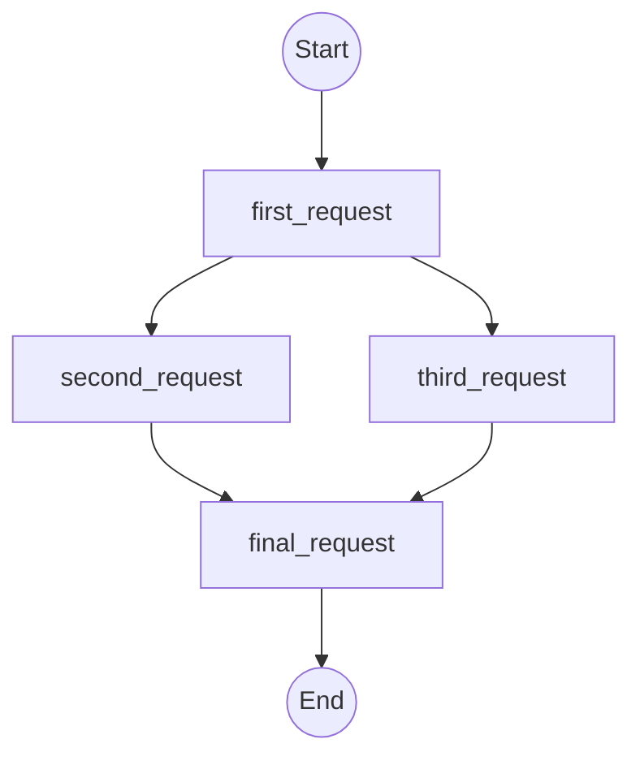

# burstgridgo
[](https://github.com/specialistvlad/burstgridgo/actions/workflows/ci.yml)


**⚠️ Important Note: Project Status ⚠️**
`burstgridgo` is currently under active development. The API and internal architecture are **not yet stable** and are subject to breaking changes. This project is not recommended for external production use; it is intended for testing and development of `burstgridgo` itself.

`burstgridgo` is a Go-native, declarative load testing tool for simulating real-world, protocol-aware workflows using HCL.

## Core Pillars
* **Declarative Grids (HCL)**: Define multi-protocol workflows (e.g., REST API -> Socket.IO -> S3) in simple, composable HCL files. Your test plans become readable, versionable infrastructure.
* **Intelligent Concurrency (DAG)**: The tool automatically builds a dependency graph (DAG) from your grid, running independent modules in parallel for maximum efficiency. Dependencies are inferred automatically from variable usage.
* **First-Class Insights (O11y + TUI)**: Testing is about understanding, not just running. Get a "cockpit view" with a live-updating Terminal UI and export rich telemetry via native OpenTelemetry to your existing observability stack (Grafana, Datadog, etc.).
* **Extensible by Design (Go Runners)**: Missing a protocol? `burstgridgo` is built on a simple Go `Runner` interface. Implement your own logic in a `.go` file, and you can immediately use it in your HCL.

## Dynamic Workflows
Create dynamic and realistic scenarios using HCL meta-arguments.
* **Looping**: Use `count` or `for_each` to run a task multiple times in parallel, perfect for generating load or testing a list of endpoints.
* **Branching**: Use a ternary expression with `count` (`count = condition ? 1 : 0`) to conditionally include a module in your workflow.

## Getting Started
Prerequisites: **Docker** and **Make**.

To run a grid for development with live-reloading, use the following command:
```sh
# This example runs the http_request.hcl grid
make dev grid=examples/http_request.hcl
```

## Example Workflow
The following grid defines a workflow with multiple dependent HTTP requests.
```hcl
# File: examples/http_request.hcl

# Make HTTP requests with dependencies
module "first_request" {
  runner = "http-request"
  url    = "[https://httpbin.org/get](https://httpbin.org/get)"
}

# Make additional HTTP requests that depend on the first request
module "second_request" {
  runner     = "http-request"
  url        = "[https://httpbin.org/delay/1](https://httpbin.org/delay/1)" // This will take 1 second
  depends_on = ["first_request"]
}

# Make a third HTTP request that also depends on the first
module "third_request" {
  runner     = "http-request"
  url        = "[https://httpbin.org/delay/2](https://httpbin.org/delay/2)" // This will take 2 seconds
  depends_on = ["first_request"]
}

# Make a final HTTP request that depends on the second and third requests
module "final_request" {
  runner     = "http-request"
  url        = "[https://httpbin.org/post](https://httpbin.org/post)"
  method     = "POST"
  depends_on = ["second_request", "third_request"]
}
```

This configuration generates the following execution graph:

```mermaid
graph TD
    Start((Start)) --> first_request;
    first_request --> second_request;
    first_request --> third_request;
    second_request --> final_request;
    third_request --> final_request;
    final_request --> End((End));
```

## Learn More
* **Roadmap & Vision**: [See where the project is headed.](./ROADMAP.md)
* **Architecture Deep Dive**: [Learn how `burstgridgo` works internally.](./docs/ARCHITECTURE.md)
* **Contributing Guide**: [Find out how you can help.](./CONTRIBUTING.md)
