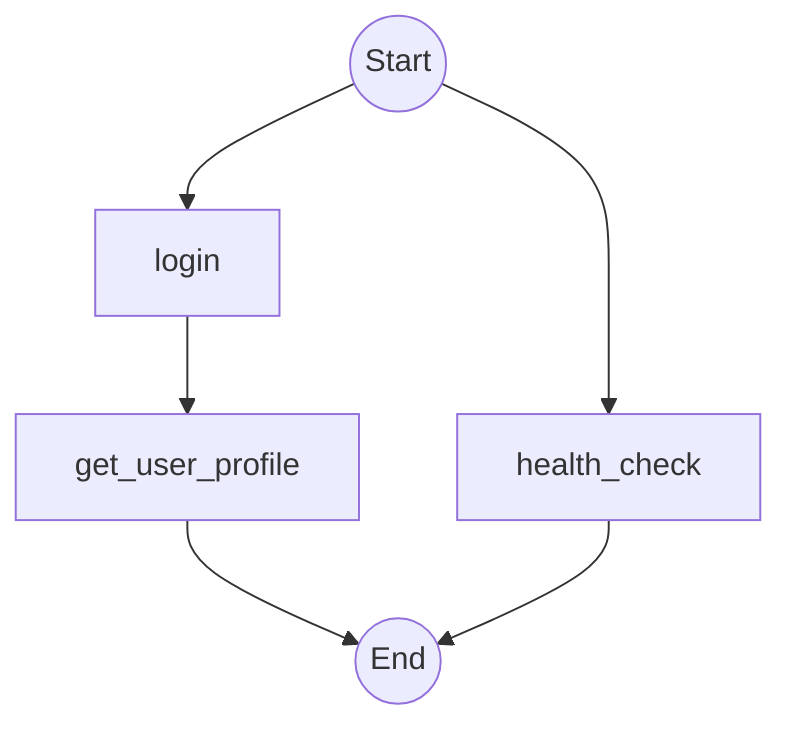

# BurstGridGo

A Go-native, declarative, and composable load testing tool for simulating real-world, protocol-aware workflows using HCL.


## 🚀 Motivation

This project started from a real moment of frustration. I just needed to simulate a realistic user workflow—one that uses a mock JWT token, communicates with a backend over Socket.IO, and uploads files to S3—and every existing tool made it harder than it should be.

I tried **k6** — great branding, solid Go engine, and scripting in JavaScript. But it couldn’t handle Socket.IO out of the box. I had to either reimplement everything manually in JavaScript or compile in a community extension. For a fast start, it was just too much.

Then I tried **Artillery** — also very capable. But it pushed me toward a cloud-based workflow I didn’t want, and its config format mixed declarative and imperative code in a way that felt awkward and hard to reason about.

I want to be clear: **these are well-crafted tools, professionally built and maintained**. But they didn’t give me the flexibility I needed for a quick, focused, extensible solution.

On top of all that, I was also looking for a meaningful way to finally learn Go — and this project felt like the perfect blend of practical need and curiosity.

## ⚙️ What burstgridgo Is (and Isn’t)

✅ A framework for simulating **real user flows**.  
✅ A developer-oriented platform to load test **anything with a protocol**.  
✅ A tool to define **parallel, branching, dependent workflows**.  

❌ Not just an HTTP benchmarker.  
❌ Not a GUI-driven enterprise suite.  
❌ Not finished — this is at the concept stage and part of my journey learning Go.


## ✨ Core Concepts

BurstGridGo uses HCL (the language of Terraform) to define execution plans, which we call **Grids**.

* **Modules**: The smallest executable unit, like an HTTP request or a WebSocket action. Each module is defined in a `module` block and assigned a unique name.

* **Runners**: Each module specifies a `runner` (e.g., `"http-request"`) that contains the Go code to execute the task. The tool is extensible by adding new runners.

* **Execution Graph (DAG)**: BurstGridGo automatically builds a Directed Acyclic Graph (DAG) from your modules.
    * **Explicit Dependencies**: Use `depends_on = ["module_a"]` to specify that one module must complete before another begins.
    * **Implicit Dependencies**: Pass output from one module to the input of another (e.g., `api_token = module.login.token`). The graph builder automatically detects this relationship as a dependency.

* **Concurrency**: Modules with no dependencies between them run concurrently by default, powered by Go's goroutines.

## ⚙️ Getting Started

### Prerequisites
* Docker
* Make

### Development
The recommended way to run the application for development is using the provided `Makefile`, which enables live-reloading inside a Docker container.

1.  **Build the development image:**
    ```sh
    make dev
    ```
    This command builds the `burstgridgo-dev` image and starts a container with your local source code mounted. The `air` tool will watch for file changes and automatically recompile and restart the application.

2.  **Run a Grid:**
    To run a specific grid (a `.hcl` file or a directory of them), set the `grid` variable on the command line.

    * **Run a directory of HCL files:**
        ```sh
        make dev grid=examples/
        ```
    * **Run a single HCL file:**
        ```sh
        make dev grid=examples/http_request.hcl
        ```
    * **Run with flags:**
        ```sh
        make dev grid="--grid examples/http_request.hcl"
        ```

### Production
The `Makefile` also includes commands for building and running a minimal, production-grade Docker image.

1.  **Build the Production Image:**
    ```sh
    make build
    ```
    This creates a tiny, secure image tagged `burstgridgo:latest` using Docker multi-stage builds.

2.  **Run the Production Image:**
    To run a grid with the production image, you must mount your local grid files into the container. The default path inside the container is `/grid`.

    ```sh
    # Mount your local './my-grids/smoke-test' directory into the container's /grid path
    docker run --rm -v ./my-grids/smoke-test:/grid burstgridgo:latest
    ```


## 📦 Example Grid

A **Grid** is a plan that defines your test workflow. BurstGridGo automatically builds an execution graph from your modules, running independent tasks concurrently.

Here is an example of an authentication workflow that runs a health check in parallel.

```hcl
# File: examples/auth_flow.hcl

# This module runs first to get an auth token.
module "login" {
  runner = "http-request"
  url    = "[https://my-api.com/auth/login](https://my-api.com/auth/login)"
  method = "POST"
  body   = jsonencode({
    user = "test-user"
    pass = "password"
  })
}

# This module depends implicitly on the "login" module's output.
# It will only run after "login" completes successfully.
module "get_user_profile" {
  runner = "http-request"
  url    = "[https://my-api.com/users/me](https://my-api.com/users/me)"
  headers = {
    # Implicit dependency: uses output from the "login" module
    Authorization = "Bearer ${module.login.body.token}"
  }
}

# This module has no dependencies and will run in parallel with the "login" flow.
module "health_check" {
  runner = "http-request"
  url    = "[https://my-api.com/health](https://my-api.com/health)"
}
```

This configuration generates the following execution graph (DAG), where health_check runs at the same time as login:


```mermaid
graph TD
    Start((Start)) --> A[login]
    Start --> C[health_check]
    A --> B[get_user_profile]
    B --> End((End))
    C --> End
```

## 🧑‍💻 Getting Involved

What began as a personal learning journey is now growing into something I hope will be useful to others.

If you're a developer who enjoys clean abstractions, concurrency, or just hates fighting tooling when you want to ship something fast, you're very welcome here.

Have ideas, feedback, or protocol needs I haven’t thought of? I’d love to hear from you. Feel free to open an issue, start a discussion, or just say hi.

Even if the code is still green, the vision is clear — and collaboration makes it better.


## 🧱 Architecture (at the concept stage)

_TODO: This section will describe the internal architecture — runners, module graph execution, and core engine._


## 🧭 Roadmap (at the concept stage)

_TODO: This section will track the development milestones, MVP features, and upcoming ideas._


## 🙏 Acknowledgements
Shout out to the creators of tools like k6, Vegeta, and Artillery—they each pushed the conversation around load testing forward.

A special thanks to HashiCorp for creating Terraform and the HCL language. Their work on declarative infrastructure and modular design was a primary inspiration for this project's architecture.

Also, a nod to the Go community for designing a language that makes concurrency feel natural and fun to work with.

BurstGridGo stands on a lot of great shoulders.

## License
MIT License

Copyright (c) 2025 luoyy

Permission is hereby granted, free of charge, to any person obtaining a copy of this software and associated documentation files (the "Software"), to deal in the Software without restriction, including without limitation the rights to use, copy, modify, merge, publish, distribute, sublicense, and/or sell copies of the Software, and to permit persons to whom the Software is furnished to do so, subject to the following conditions:

The above copyright notice and this permission notice shall be included in all copies or substantial portions of the Software.

THE SOFTWARE IS PROVIDED "AS IS", WITHOUT WARRANTY OF ANY KIND, EXPRESS OR IMPLIED, INCLUDING BUT NOT LIMITED TO THE WARRANTIES OF MERCHANTABILITY, FITNESS FOR A PARTICULAR PURPOSE AND NONINFRINGEMENT. IN NO EVENT SHALL THE AUTHORS OR COPYRIGHT HOLDERS BE LIABLE FOR ANY CLAIM, DAMAGES OR OTHER LIABILITY, WHETHER IN AN ACTION OF CONTRACT, TORT OR OTHERWISE, ARISING FROM, OUT OF OR IN CONNECTION WITH THE SOFTWARE OR THE USE OR OTHER DEALINGS IN THE SOFTWARE.
