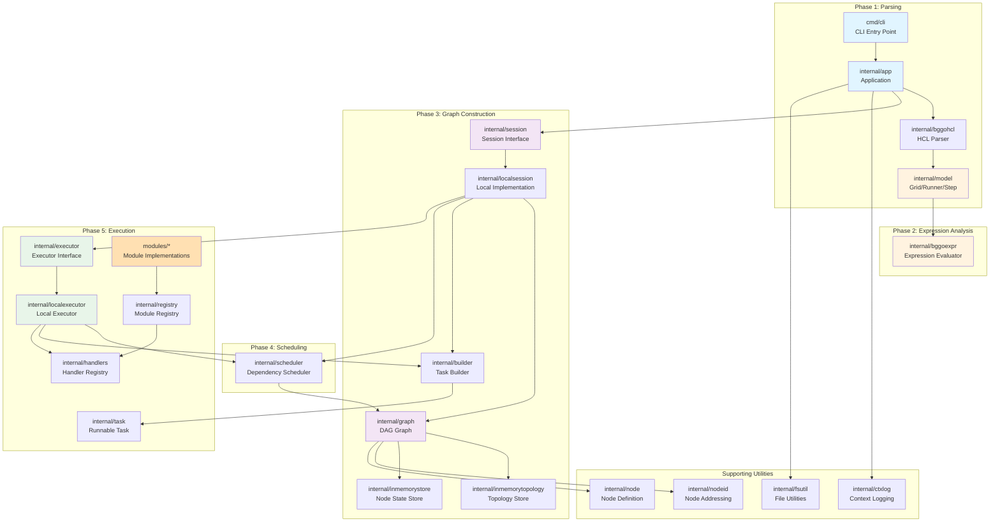
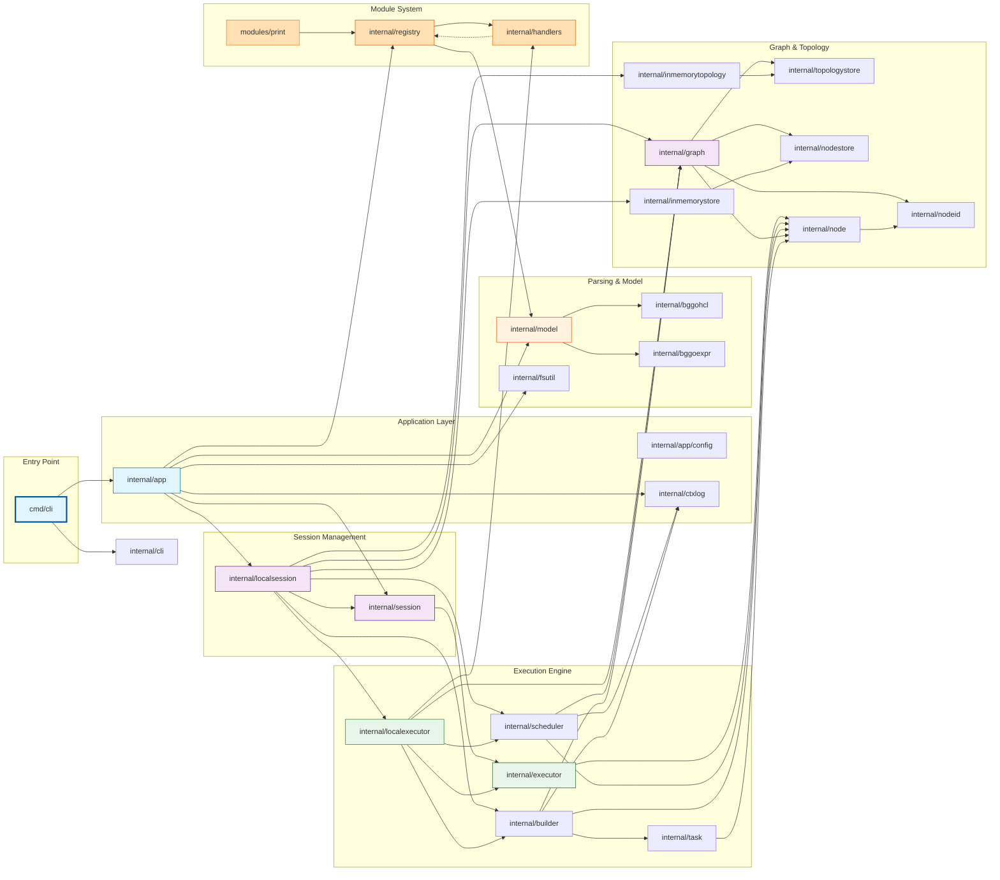
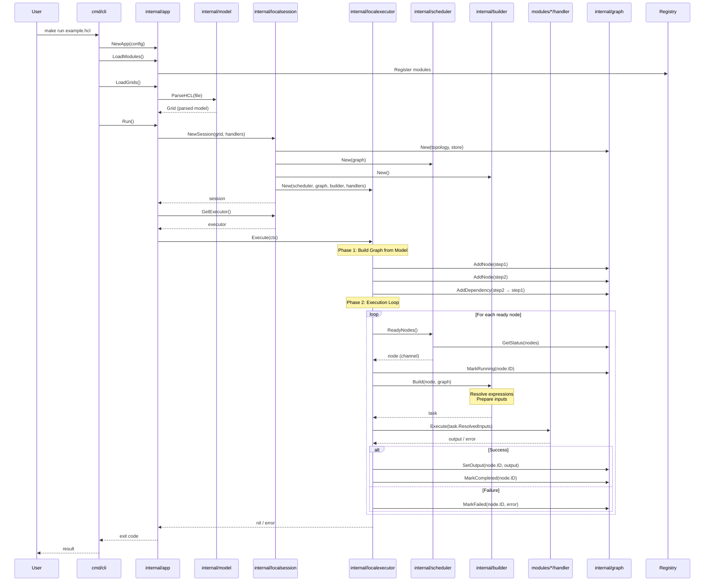

# BurstGridGo Architecture

This document provides architectural diagrams showing the structure and relationships of all packages in BurstGridGo.

## Table of Contents
- [High-Level Architecture](#high-level-architecture)
- [Package Dependency Graph](#package-dependency-graph)
- [Execution Pipeline](#execution-pipeline)
- [Package Descriptions](#package-descriptions)

---

## High-Level Architecture

The system follows a **5-phase declarative execution pipeline**:

---

## Package Dependency Graph

Detailed view of all internal packages and their dependencies:

---

## Execution Pipeline

Step-by-step flow from HCL file to execution:

---

## Package Descriptions

### Entry Point & Application
- **cmd/cli** - CLI entry point, argument parsing via `internal/cli`, panic recovery
- **internal/app** - Application initialization, module/grid loading, session orchestration
- **internal/cli** - CLI argument parsing and validation
- **internal/ctxlog** - Context-aware structured logging using `slog`

### Parsing & Model Layer
- **internal/model** - Core data structures: `Grid`, `Runner`, `Step`, `Variable`, `Local`
- **internal/bggohcl** - HCL parsing utilities using HashiCorp HCL v2
- **internal/bggoexpr** - Expression extraction and analysis using go-cty
- **internal/fsutil** - File system utilities for finding HCL files

### Session Management
- **internal/session** - Session abstraction (interface for local/distributed execution)
- **internal/localsession** - Local session implementation with dependency injection

### Graph & State Management
- **internal/graph** - Stateful DAG representation, node state tracking
- **internal/node** - Node definition (ID, type, config, dependencies, status)
- **internal/nodeid** - Node addressing system (`<type>.<name>[index]`)
- **internal/inmemorytopology** - In-memory topology storage (DAG structure)
- **internal/inmemorystore** - In-memory node state storage (status, output, errors)
- **internal/topologystore** - Topology store interface
- **internal/nodestore** - Node store interface

### Execution Engine
- **internal/executor** - Executor interface (DAG execution orchestration)
- **internal/localexecutor** - Local executor implementation
- **internal/scheduler** - Dependency-based node scheduling
- **internal/builder** - Task builder (expression resolution, input preparation)
- **internal/task** - Runnable task representation

### Module System
- **internal/registry** - Module registry, runner definitions, handler management
- **internal/handlers** - Handler registration and lookup
- **modules/print** - Example module (print runner implementation)

### Testing & Utilities
- **internal/integrationtests** - End-to-end integration tests (67.5% coverage)
- **internal/testutil** - Testing utilities and harnesses

---

## Architecture Highlights

### 1. Layered Architecture
Clean separation between parsing, validation, graph building, and execution phases.

### 2. Interface-Driven Design
- `session.Session` - Execution environment abstraction
- `executor.Executor` - Execution orchestration interface
- `scheduler.Scheduler` - Node scheduling interface
- `builder.Builder` - Task building interface
- `graph.Graph` - Graph operations interface

### 3. Store Pattern
State and topology managed via separate store interfaces for flexibility:
- Topology (DAG structure) → `topologystore.TopologyStore`
- Node state (status, output) → `nodestore.NodeStore`

### 4. Type-Safe Throughout
HCL → strongly-typed Go structs → validated model → executable graph

### 5. Expression Isolation
HCL expressions evaluated during graph construction, not during execution.

### 6. Dependency Injection
Session factory wires up all execution components with proper dependencies.

---

## Current Implementation Status

| Layer | Status | Notes |
|-------|--------|-------|
| **CLI & App** | ✅ Complete | Argument parsing, logging, configuration |
| **HCL Parsing** | ✅ Complete | Fully parses HCL into model structs |
| **Model Layer** | ✅ Complete | Grid, Runner, Step structures |
| **Expression Analysis** | ✅ Complete | Extracts references and functions |
| **Node Addressing** | ✅ Complete | Robust `<type>.<name>[index]` system |
| **Session** | ✅ Wired | Creates and wires dependencies |
| **Graph** | ⚠️ Defined | Interfaces defined, needs population from model |
| **Scheduler** | ❌ Stub | Returns empty channel |
| **Builder** | ❌ Stub | Returns empty task |
| **Executor** | ❌ Stub | Just logs "placeholder" |
| **Handlers** | ✅ Complete | Registration works |
| **Modules** | ⚠️ Minimal | Only `print` module exists |

**Next Priority:** Implement execution pipeline (graph population → scheduler → builder → executor loop)

---

Generated: 2025-11-21